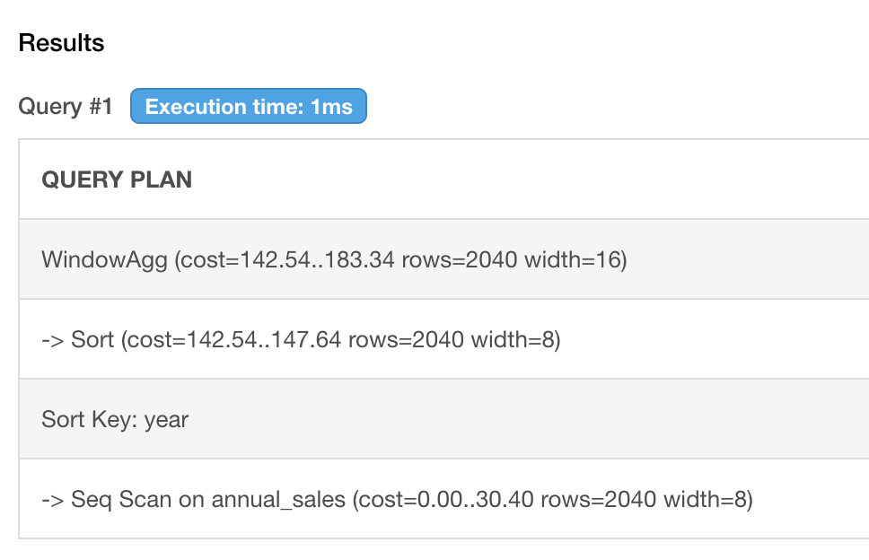

# Query Performance

## Introducton

In this lesson, we'll go over some ideas on how to improve query performance.

## Objectives
- Learn theory behind query performance
- Learn how to reduce table size
- How to use `EXPLAIN` keyword

### What is query performance tuning?

SQL tuning is the process of improving queries to accelerate server performance in the end. The purpose of it is to reduce the amount of time it takes a user to receive a query result after executing a query, and to reduce the amount of resources used to execute a query.

### What goes behind a query?

A database is a software and its limited to the hardware that it lives in. Because this is something we can't change, what we can do is make the query to run faster is to reduce the number of computation. To do this, we'll need to understand what goes behind this computation.

- Table size: The number of rows in the table matters. If one or more tables involved in the query has more tha millions or more rows, the performance will be affected.
- Joins: If the tables are joined, this can also affect performance.
- Aggregations: If there are aggregating functions involved over millions of rows, this will also affect performance.

Query runtime can also be impacted by others that you cannot control. Remember, the database can and will be used by multiple peers, so having multiple peers executing resource-intensive queries, or systems working on ETL (extract-transform-load) jobs can also slow down your query runtime. These are something we can't control, so let's focus on things we can control.

### Reducing table size

Filtering data on some columns would be a good idea. Something that we can easily do is filtering on timestamps if there is one, like below:

```
SELECT *
  FROM sample_event_table
 WHERE event_date >= '2014-03-01'
   AND event_date <  '2014-04-01'
```

This will reduce the amount of data you're querying. Keep in mind to do exploratory data analysis on a sample set of data, then execute the full query once your theories are set in stone.

### Reducing complications in joins

In some sense, this is the extension of the previous discussion. You can reduce the table size then join, which will ultimately reduce the size. Another way to further improve is to join on using foreign keys in case of parent and children relationships.

### Explain Keyword

To see the query performance, you can use the `EXPLAIN` keyword to see the query plan in text. Let's go to [db-fiddle](https://www.db-fiddle.com/) and copy-paste the following DDL on the left pane. For this exercise, use `Postgres` on the top left instead of `sqlite`.

```
CREATE TABLE ANNUAL_SALES (
  id INTEGER PRIMARY KEY,
  year INTEGER,
  sales INTEGER
);

INSERT INTO ANNUAL_SALES VALUES (1, 2016, 87000);
INSERT INTO ANNUAL_SALES VALUES (2, 2017, 65000);
INSERT INTO ANNUAL_SALES VALUES (3, 2018, 68000);
INSERT INTO ANNUAL_SALES VALUES (4, 2019, 79000);
INSERT INTO ANNUAL_SALES VALUES (5, 2020, 83000);
INSERT INTO ANNUAL_SALES VALUES (6, 2021, 92000);
INSERT INTO ANNUAL_SALES VALUES (7, 2022, 98000);
```

And copy this into the right pane.
```
EXPLAIN
SELECT 
   year,
   sales AS current_total_sale,
   LAG(sales) OVER(ORDER BY year) AS previous_total_sale,
   sales - LAG(sales) OVER(ORDER BY year) AS difference
FROM ANNUAL_SALES;
```

If you execute the query, you'll see this result instead of the usual result set.


If you see above, the entry at the bottom is the first computation the query executed. The scan on the table first by the sort key, year, then as we can see, it applies the window aggregate function, which is `LAG()`. You can use the `EXPLAIN` keyword to further study the query computation and see where you can possibly reduce computation. More information is can be found in [postgres official documentation](https://www.postgresql.org/docs/9.0/sql-explain.html).

### Summary

We looked at how we can use the `EXPLAIN` keyword to study to optimize performance, as well as few other methods like reducing table size and join on using foreign keys.
